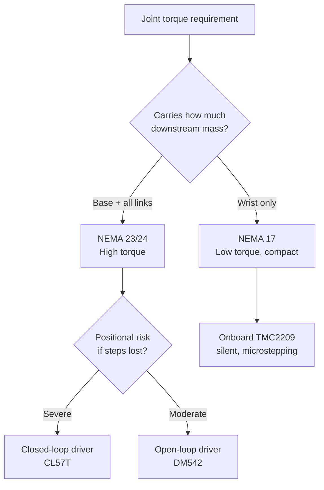
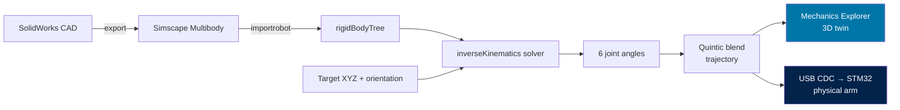
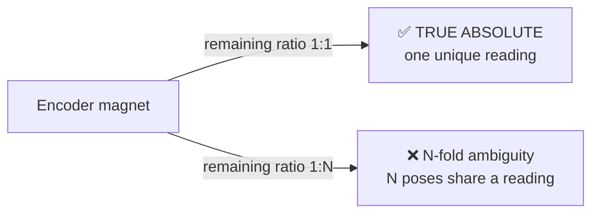
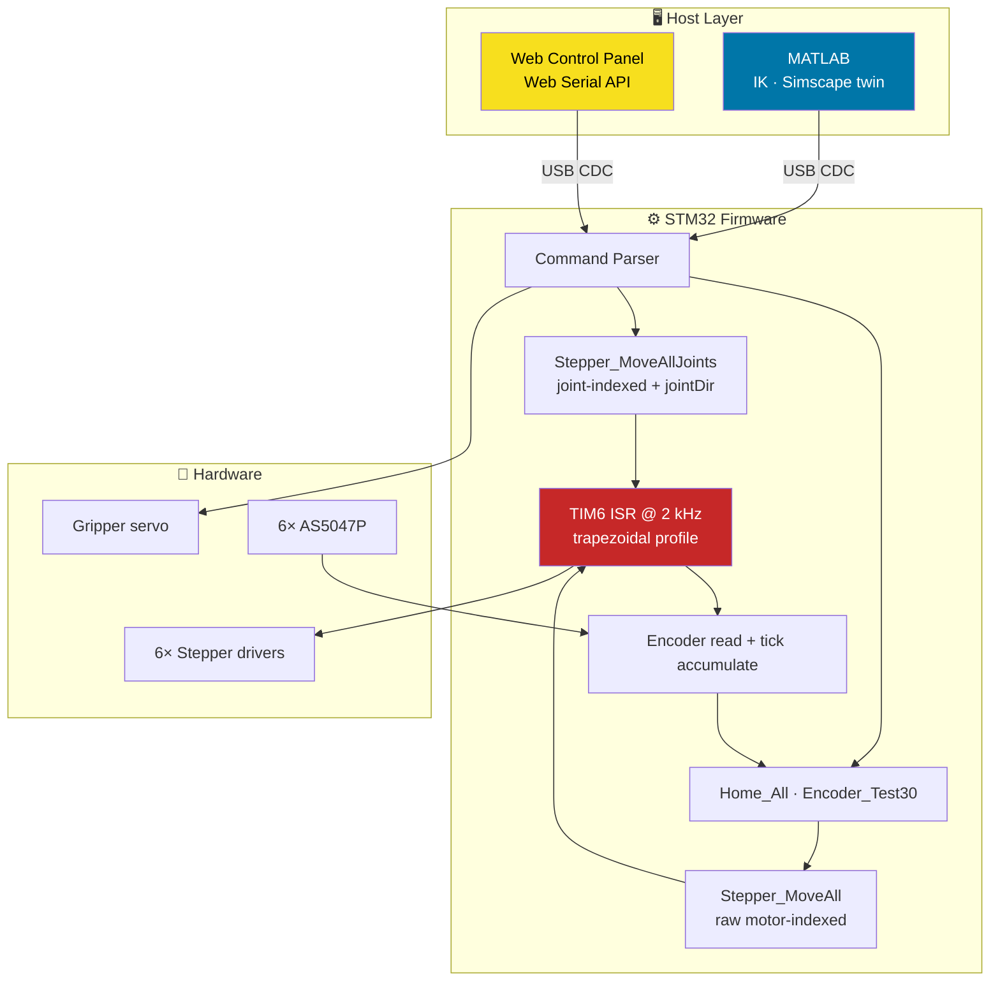
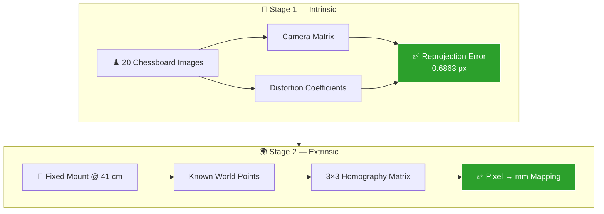

<div align="center">

# 🦾 NeuralNexus Arm

### A 6-DOF robotic arm built from scratch — mechanics, firmware, kinematics, and a live digital twin.

[](#)
[-A8B9CC?style=for-the-badge&logo=c&logoColor=black)](#)
[](#)
[](#)
[](#)


</div>

---

## 📑 Table of Contents

| # | Section |
|---|---------|
| 1 | [Motor Selection](#1--motor-selection) |
| 2 | [Motors, Gearing, Speeds & Joints](#2--motors-gearing-speeds--joints) |
| 3 | [Simulation, IK & Path Planning](#3--simulation-ik--path-planning) |
| 4 | [Mechanical & Electrical Challenges](#4--mechanical--electrical-challenges) |
| 5 | [Hardware Stack](#5--hardware-stack) |
| ➕ | [Software Architecture](#-software-architecture) · [Control Panel](#-web-control-panel) · [Quick Start](#-quick-start) · [Roadmap](#-roadmap) |

---

## 🎯 What This Is

A fully custom 6-axis robotic arm — **not a kit**. Every layer was designed, debugged, and integrated in-house:

```
CAD (SolidWorks)  →  Simscape Multibody twin  →  Inverse Kinematics solver
                                ↓
                     USB CDC @ 115200 baud
                                ↓
              STM32H743 @ 420 MHz  →  6 stepper axes + gripper
                                ↓
                  AS5047P absolute encoders (SPI feedback)
```

**The headline feature:** a single command drives the **physical arm and the 3D digital twin simultaneously**, in sync, in real time.

---

## 1. 🔧 Motor Selection

Motor choice was driven by one principle: **torque scales with how much arm you're carrying.** The base carries everything; the wrist carries almost nothing. So the arm uses a *tiered* motor strategy rather than six identical motors.

### Selection Logic



### Why Each Choice

| Tier | Joints | Motor | Reasoning |
|:-----|:-------|:------|:----------|
| **Heavy** | J2, J3 | **NEMA 24** | Shoulder & elbow lift the entire outboard arm at maximum lever arm. Highest torque demand in the system. |
| **Medium** | J1 | **NEMA 23** | Base rotation carries full mass but works against *inertia*, not gravity — lower continuous torque than the lifting joints. |
| **Light** | J4, J5, J6 | **NEMA 17** | Wrist joints position only the end-effector. Compact size matters more than torque — mass here penalises every joint below it. |

> 💡 **Design insight:** every gram added at the wrist is a gram J2 and J3 must lift at full extension. Motor *mass* is a design constraint, not just torque.

### Driver Pairing

| Driver | Joints | Type | Why |
|:-------|:-------|:-----|:----|
| **CL57T** | J2, J3 | Closed-loop | Missed steps on the lifting joints = the arm silently drops. Closed-loop drivers detect and correct stalls internally. |
| **DM542** | J1 | Open-loop | Base rotation is more forgiving — a lost step is a heading error, not a collapse. |
| **TMC2209** | J4, J5, J6 | Onboard, silent | Integrated on the custom PCB. Quiet operation, fine microstepping, no external driver boxes for the wrist. |

---

## 2. ⚙️ Motors, Gearing, Speeds & Joints

### Full Drivetrain Map

| Joint | Role | Motor Slot | Motor | Driver | Signal Type | Gear Ratio | Pulses / Joint Rev |
|:------|:-----|:-----------|:------|:-------|:------------|:-----------|:-------------------|
| **J1** | Base rotation | M6 | NEMA 23 | DM542 | Open-drain | **1 : 7** | 2800 |
| **J2** | Shoulder | M4 | NEMA 24 | CL57T | Open-drain | **1 : 30** | 5000 |
| **J3** | Elbow | M5 | NEMA 24 | CL57T | Open-drain | **1 : 30** | 5000 |
| **J4** | Wrist pitch | M2 | NEMA 17 | TMC2209 | Push-pull | **1 : 1** | 6400 |
| **J5** | Wrist roll | M1 | NEMA 17 | TMC2209 | Push-pull | **1 : 1** | 1600 |
| **J6** | End-effector | M3 | NEMA 17 | TMC2209 | Push-pull | **1 : 1** | 1600 |

> ⚠️ **Joints are NOT wired in motor order.** The joint→motor mapping is `jointToMotor[6] = {5, 3, 4, 1, 0, 2}`. This is baked into firmware so every layer above it can think in clean joint numbers (J1…J6, base→tip).

### J2 / J3 Compound Drivetrain

The two lifting joints use a **two-stage reduction** — and where the encoder sits inside that chain turns out to matter enormously (see §4):

```
Motor ──[ 1:10 planetary gearbox ]──► ENCODER ──[ 1:3 belt/pulley ]──► Joint
                                        ▲
                              magnet mounted HERE
                         (3 encoder turns per joint turn)
```

### Joint Limits & Reference Pose

| Joint | Min (°) | Max (°) | Range | Stable Pose (°) | Notes |
|:------|--------:|--------:|------:|----------------:|:------|
| J1 | −180 | +180 | 360° | 0 | Full rotation |
| J2 | −70 | +70 | 140° | −5 | Gravity-limited |
| J3 | **+120** | +240 | 120° | **120** | ⚠️ Starts *at* its lower limit — can only move **up** |
| J4 | −180 | +180 | 360° | 0 | Full rotation |
| J5 | +60 | +300 | 240° | 160 | 180°-centred band |
| J6 | −180 | +180 | 360° | 0 | Full rotation |

**Stable reference pose:** `[0, −5, 120, 0, 160, 0]` — the hand-matched starting configuration that keeps the physical arm and the simulation aligned for all relative motion.

### Motion Control Parameters

<table>
<tr><td><b>Control loop</b></td><td>TIM6 ISR @ <b>2 kHz</b> (PSC 74, ARR 499)</td></tr>
<tr><td><b>Tick period</b></td><td>500 µs</td></tr>
<tr><td><b>Max step rate</b></td><td>2000 steps/s (1 step per tick — hard ceiling)</td></tr>
<tr><td><b>Working speed</b></td><td>400 steps/s per joint</td></tr>
<tr><td><b>Acceleration</b></td><td>150 steps/s²</td></tr>
<tr><td><b>Profile</b></td><td>Trapezoidal ramp with decel-to-stop lookahead</td></tr>
</table>

### The Motion Profile

Every axis runs a non-blocking trapezoidal velocity profile inside the ISR — accelerate, cruise, decelerate — computed independently per joint:

```
speed
  ▲
  │     ┌─────────────────┐
  │    ╱                   ╲
  │   ╱                     ╲
  │  ╱                       ╲
  └─┴─────────────────────────┴──► time
    accel        cruise      decel
         (stepsToStop lookahead)
```

> 📐 **The scaling trap:** when the ISR was retuned from 50 kHz → 2 kHz, the hardcoded constants `dt = 0.00002` and `stepInterval = 50000/speed` were **25× wrong**, making every motor crawl. Correct values: `dt = 0.0005`, `stepInterval = 2000/speed`. Tick rate and motion math must always be changed together.

### Command Protocol

| Command | Format | Example | Action |
|:--------|:-------|:--------|:-------|
| **Joint move** | 6 comma-separated degrees | `0,-50,60,-80,-90,50` | Relative move on all six joints |
| **Gripper** | `G,<0\|1>` | `G,1` | Open / close servo |
| **Home** | `HOME` | `HOME` | Encoder-based homing (J4/J5/J6) |
| **Test** | `TEST` | `TEST` | 30° encoder calibration measurement |

---

## 3. 🧠 Simulation, IK & Path Planning

### Pipeline



### Kinematic Model

The CAD assembly exports directly into a **`rigidBodyTree`**, with real joint limits applied so the solver never proposes an unreachable pose:

```matlab
robot = importrobot('Assem1');
robot.DataFormat = 'row';
limitsDeg = [-180 180; -70 70; 120 240; -180 180; 60 300; -180 180];
for i = 1:6
    robot.Bodies{i}.Joint.PositionLimits = deg2rad(limitsDeg(i,:));
end
ik = inverseKinematics('RigidBodyTree', robot);
```

### Trajectory Generation

Paths are interpolated with a **quintic (5th-order) blend** rather than linear interpolation — this gives zero velocity *and* zero acceleration at both endpoints, so motion starts and stops smoothly instead of jerking:

```matlab
b = (k-1)/(steps-1);
blend = 10*b^3 - 15*b^4 + 6*b^5;   % smoothstep: S-curve, C² continuous
pose = startPose + (targetPose - startPose) * blend;
```

### Planned Paths & Demos

| Demo | What It Proves | Method |
|:-----|:---------------|:-------|
| 🎯 **Position Lock** | Tip holds a fixed point in space while the arm reconfigures around it | IK solved for constant XYZ, sweeping orientation |
| 🧭 **Orientation Lock** | Tool orientation stays fixed while the tip sweeps X, then Y, then Z | IK solved for constant rotation matrix, moving XYZ |
| ⬜ **Vertical Square** | Coordinated multi-joint straight-line tracing | 4 corners in the Y–Z plane, edges interpolated, IK per point |
| 👋 **Bye Wave** | Balanced choreography that returns exactly to start | Hand-tuned deltas, every joint column sums to zero |
| 🤖 **Pick & Place** | Full task sequence with gripper actuation | Recorded relative poses + `G,0` / `G,1` |

> 🔬 **A fundamental result we proved (and had to design around):**
>
> **A 6-DOF arm cannot hold tip position AND tool orientation fixed simultaneously while the links reconfigure.** That needs a 7th degree of freedom. Six DOF = exactly six constraints = a unique solution with no redundancy left to exploit. Every "lock" demo therefore locks *one* constraint and varies the other. This wasn't a bug — it's the kinematics telling us the truth.

### Synchronised Twin

The `moveBoth()` function is the centrepiece — one call, two arms:

```matlab
moveBoth(s, [0 10 0 0 0 0])   % J2 +10° on BOTH the real arm and the simulation
```

It tracks accumulated pose in a persistent variable, runs a soft-limit check before committing, streams the delta over serial, and animates the Simscape model — all from a single command.

---

## 4. 🔥 Mechanical & Electrical Challenges

> *This is the section that actually took the time.* Every entry below cost hours of debugging and is documented so it never has to be rediscovered.

### 🥇 The Big One: Phantom Encoder Wander

**Symptom:** encoder readings on a *stationary* joint appeared to swing by **60–70°** between samples. Completely unusable for absolute positioning.

**Failed hypotheses** (each cost a debugging cycle):

| Theory | Test | Result |
|:-------|:-----|:-------|
| SPI too fast → signal integrity | Slowed prescaler 32 → 64 | Slightly better |
| Still too fast | Slowed further → 128 | ❌ **Got WORSE** |
| ISR corrupting SPI mid-frame | Moved reads to main loop | ❌ No change |

**Actual root cause:** the read function returns **`−1` on a failed read**, and those `−1` sentinels were being **averaged in with valid readings**. A few error codes in a 30-sample mean dragged the average wildly. The sensor was perfect the whole time.

**Fix:** filter `−1` before averaging.

```matlab
if row(j) >= 0            % ← the entire fix
    sums(j) = sums(j) + row(j);
    counts(j) = counts(j) + 1;
end
```

**Result:** readings repeatable to **±0.01°** across runs.

```
BEFORE (raw mean):  J4 = 310.40 → 274.49 → 346.27    (±72° spread) ❌
AFTER  (filtered):  J4 = 181.88 → 181.88 → 181.88    (±0.01°)      ✅
```

> 🧠 **The lesson:** *"slowing it down made it worse"* was the decisive clue. A genuine signal-integrity problem always improves with a slower clock. When it didn't, the problem was never analogue — it was a data-hygiene bug in software.

---

### ⚡ Electrical Failures

<table>
<tr><th align="left">Failure</th><th align="left">Cause</th><th align="left">Resolution</th></tr>
<tr>
<td>💀 <b>3 GPIO pins destroyed</b><br/><code>PE0</code>, <code>PD7</code>, <code>PD3</code></td>
<td>5 V back-feed during miswired open-drain testing — external pull-ups fed 5 V into 3.3 V-tolerant-only pins</td>
<td>Remapped in <code>.ioc</code> → <code>PE7</code>, <code>PD11</code>, <code>PD12</code>. Dead pins left unassigned (Hi-Z). One bodge wire via the <code>M3_MS1</code> pad.</td>
</tr>
<tr>
<td>💀 <b>LDO destroyed</b><br/><code>ST1L05CPU33R</code> (3.3 V rail)</td>
<td>Failed on connection to the main electronics compartment — suspected input overvoltage, inductive transient from the steppers, or insufficient local decoupling</td>
<td><b>Open.</b> Measure actual V<sub>IN</sub> at the LDO footprint <i>before</i> fitting a replacement.</td>
</tr>
</table>

---

### 🔌 The Driver Topology Trap

The custom PCB mixes **two electrically incompatible driver families**, and getting the GPIO mode wrong produces a *silent* failure — no error, the motor just doesn't move.

| | J4 / J5 / J6 (TMC2209) | J1 / J2 / J3 (CL57T · DM542) |
|:--|:--|:--|
| **Mounting** | Onboard | External boxes |
| **GPIO mode** | `OUTPUT_PP` (push-pull 3.3 V) | `OUTPUT_OD` (open-drain) |
| **Wiring** | Direct logic | Common-anode via optocoupler |
| **Enable** | `SetEnableM1M2M3(true)` → LOW | `SetEnableM4M5M6(false)` → **HIGH** |

> ⚠️ **Counter-intuitive but correct:** `Stepper_SetEnableM4M5M6(false)` is what **enables** the external drivers. With common-anode wiring, driving the open-drain pin HIGH releases it (Hi-Z) → opto LED dark → drivers enabled. This looks like a bug in code review. **It is not. Do not "fix" it.**

---

### 🐛 Firmware Bugs Worth Remembering

<details>
<summary><b>Double direction handling</b> — homing only converged from one side</summary>

`Stepper_MoveAllJoints()` applies `jointDir[]` internally. The homing routine *also* computed direction from the measured `encStepSign`. Two sign flips = they cancelled on one side of the target and doubled on the other.

**Fix:** homing and encoder-driven motion must use `Stepper_MoveAll()` — the raw, motor-indexed mover with **no** `jointDir` applied.
</details>

<details>
<summary><b>The unreachable gripper branch</b> — <code>G,0</code> silently did nothing</summary>

```c
if (rxFlag) {
    rxFlag = 0;                    // ← cleared here
    ...
    else if (rxFlag) {             // ← always FALSE. Dead branch.
        if (rxTemp[0] == 'G') { Gripper_Open(); }   // never reached
    }
}
```

The gripper worked perfectly when called directly from the loop — which proved the hardware was fine and pointed straight at command dispatch.

**Fix:** flatten the handler; make the gripper check a top-level `else if`.
</details>

<details>
<summary><b>Off-by-one on joint index</b> — J6 refused to home</summary>

`uint8_t j = 6;` — but joints are indexed **0–5**. J6 is index **5**. Every array access (`homeAngle[6]`, `motors[6]`, `js[6]`) read past the end of its array — undefined behaviour that happened to produce silence instead of a crash.
</details>

<details>
<summary><b>Two infinite loops</b> — commands ignored while encoders streamed</summary>

A leftover `while(1)` encoder-print loop sat *above* the main loop, trapping the CPU forever. The command handler below it was never reached. Symptom looked like "the arm reads encoders but ignores serial" — actually the CPU never got there.
</details>

<details>
<summary><b>Serial handshake deadlock</b> — MATLAB froze mid-demo</summary>

A periodic `enc |` status print flooded the serial line, so MATLAB's `readline() == "END"` handshake never matched → infinite wait, sim and arm both frozen.

**Fix:** telemetry streaming and command handshaking cannot share one wire. Pick one mode at a time, or make the reader tolerant with a timeout.
</details>

---

### ⏱️ The Timing Discovery

**Symptom:** commanding 60° produced only ~30° of motion. Increasing the amplitude didn't help.

**Measurement:** a 60° move physically takes **~4 seconds** at 400 steps/s. The demo scripts were sending the next command after **1 second** — every move was being interrupted at ~25% completion and replaced with a fresh target.

**Solution (user-devised):** never send a move larger than **10°**. Split a 60° move into six 10° commands, each of which completes comfortably within the 1 s window.

```matlab
nChunks   = ceil(max(abs(delta)) / 10);
stepDelta = delta / nChunks;
for c = 1:nChunks
    writeline(s, sprintf('%.2f,%.2f,%.2f,%.2f,%.2f,%.2f', stepDelta));
    pause(1.0);
end
```

> ✅ Elegant because it needs **no firmware change and no handshake** — it just respects the physics of how long a move actually takes.

---

### 🔩 Mechanical: The Simscape Over-Constraint

The imported model wouldn't move at all. Cause: **over-constrained SolidWorks mates**.

| Problem | Effect |
|:--------|:-------|
| Extra Parallel / Perpendicular mates | Collapsed revolute joints into rigid welds — zero DOF |
| Base mated to non-adjacent links | Created closed kinematic loops the solver couldn't resolve |

**Rule established:** exactly **one concentric + one coincident/distance** mate per joint. Nothing more. Clean serial chain: `Base → P1 → P2 → P3 → P4 → P5 → EndEffector`.

---

### 🧲 The Encoder Mounting Constraint

The most consequential *mechanical* decision in the project — and it was discovered after the fact.

An AS5047P is absolute over **one magnet revolution**. Whether a joint can determine its own position at power-on depends entirely on **what gearing remains between the magnet and the joint**:



| Joint | Ratio *after* encoder | Absolute on boot? | Consequence |
|:------|:---------------------|:------------------|:------------|
| J1 | 1 : 7 | ❌ | 7 candidate positions per reading |
| J2 | 1 : 3 | ❌ | 3 candidates |
| J3 | 1 : 3 | ❌ | 3 candidates |
| **J4** | **1 : 1** | ✅ | Unique — true absolute |
| **J5** | **1 : 1** | ✅ | Unique — true absolute |
| **J6** | **1 : 1** | ✅ | Unique — true absolute |

**Workaround in use:** hand-position the arm *roughly* near home, then command `HOME`. Pre-positioning within one encoder revolution removes the ambiguity entirely, letting the encoder resolve the fine error. Clever, free, and it works today.

**Permanent fix (future revision):** relocate the J1/J2/J3 magnets to the *joint side* of the final reduction. All six joints then become absolute and the whole problem disappears.

---

### 💻 Host-Side Gotchas

| Issue | Symptom | Fix |
|:------|:--------|:----|
| **USB CDC won't enumerate** | Device Manager shows nothing / "Unknown Device" | Route **HSI48** to USB clock + call `HAL_PWREx_EnableUSBVoltageDetector()` **before** `MX_USB_DEVICE_Init()` |
| **Board freezes at boot** | No LED, no USB, totally dead | `MX_SDMMC1_SD_Init()` traps in `Error_Handler()` with no SD card. Keep SDMMC1 + FATFS **disabled in the `.ioc`** |
| **COM port keeps changing** | COM9 → COM12 → COM14… | Windows caches stale USB devices. Device Manager → *Show hidden devices* → uninstall greyed entries → replug |
| **`importrobot` fails** | "Variable `jointData` has been deleted" | Simscape *From Workspace* blocks are evaluated during import. Run `jointData = zeros(2,7);` **first** |
| **Timer resource conflict** | Gripper twitched whenever the buzzer sounded | Both were on TIM2. `Buzzer_SetFreq()` reprograms PSC/ARR, destroying the servo's 50 Hz frame. **Moved gripper to TIM1_CH3** — conflict eliminated |

---

## 5. 🛠️ Hardware Stack

### Compute

| Component | Spec |
|:----------|:-----|
| **MCU** | STM32H743VITx, Cortex-M7 |
| **Clock** | 420 MHz (25 MHz HSE → PLL) |
| **PCB** | Custom board (migrated from WeAct MiniSTM32H743 dev board) |
| **Toolchain** | STM32CubeIDE + CubeMX (HAL) |

### Actuation

| Component | Detail |
|:----------|:-------|
| **Steppers** | 2× NEMA 24 · 1× NEMA 23 · 3× NEMA 17 |
| **Closed-loop drivers** | 2× CL57T (J2, J3) |
| **Open-loop driver** | 1× DM542 (J1) |
| **Onboard drivers** | 3× TMC2209 (J4, J5, J6) |
| **Gripper** | Hobby servo · TIM1_CH3 · 50 Hz PWM · 930 µs open / 1100 µs close |

### Sensing

| Component | Detail |
|:----------|:-------|
| **Encoders** | 6× AS5047P magnetic absolute, 14-bit (16384 counts/rev) |
| **Bus** | SPI1 — 16-bit frames, CPOL HIGH / CPHA 2EDGE (mode 1) |
| **Chip selects** | `PB0` `PB1` `PB2` `PC7` `PC6` `PD15` (active-LOW) |
| **Noise floor** | ±0.04° at rest (after `−1` filtering) |

### Peripherals & I/O

| Function | Resource |
|:---------|:---------|
| Stepper control loop | TIM6 @ 2 kHz interrupt |
| Gripper servo PWM | TIM1_CH3 |
| Buzzer | TIM2_CH2 / PA1 |
| Host link | USB CDC Virtual COM @ 115200 |
| Status | Onboard LED, user buttons |

### Peripheral Allocation

```
TIM1 ─── CH3 ──► Gripper servo PWM (50 Hz)
TIM2 ─── CH2 ──► Buzzer (variable frequency)
TIM6 ─────────► Stepper ISR @ 2 kHz  ◄── the heartbeat
SPI1 ─────────► AS5047P encoder chain ×6
USB  ─────────► CDC Virtual COM Port
```

> 🧯 **Peripheral conflicts are real.** The gripper and buzzer originally shared TIM2 and were mutually exclusive — playing a tone corrupted the servo signal. Separating them onto different timers was a genuine architectural fix, not cosmetic.

---

## 🏗️ Software Architecture



### Two Movers, One Critical Distinction

| Function | Indexing | Applies `jointDir`? | Use for |
|:---------|:---------|:-------------------|:--------|
| `Stepper_MoveAllJoints()` | **Joint** (J1…J6) | ✅ Yes | Commands from MATLAB / UI |
| `Stepper_MoveAll()` | **Motor** (M1…M6) | ❌ No | Homing & encoder-driven correction |

> ☝️ Mixing these up causes the **double-direction bug** — the single most time-consuming class of error in this project. Encoder feedback already knows the true physical direction via `encStepSign`; applying `jointDir` on top of it inverts the correction on one side of the target.

---

## 🎛️ Web Control Panel

A standalone **Web Serial** control panel that talks to the arm directly — **no MATLAB, no Python, no install.** Just open the HTML file in Chrome or Edge.

```
┌──────────────────────────────────────────────┐
│  🔌 Connect arm        ● Connected     ■ Stop │
├──────────────────────────────────────────────┤
│  RECORDED SEQUENCES                Delay [4]s │
│  ┌──────────┬──────────┬───────────────────┐ │
│  │ Show off │   Pick   │ Place from pole   │ │
│  ├──────────┼──────────┴───────────────────┤ │
│  │Pick pole │  Pick and place pole         │ │
│  └──────────┴──────────────────────────────┘ │
├──────────────────────────────────────────────┤
│  JOINT CONTROL — relative move               │
│  J1 ─────────────●─────────────   0°         │
│  J2 ─────────────●─────────────   0°         │
│  J3 ─────────────●─────────────   0°    …    │
│           [ Send move ]   [ Reset ]          │
├──────────────────────────────────────────────┤
│  [ Open ]   [ Close ]   [ Home ]             │
│  > 0,-50,60,-80,-90,50            [ Send ]   │
└──────────────────────────────────────────────┘
```

| Feature | Detail |
|:--------|:-------|
| **Transport** | Web Serial API @ 115200 — direct browser-to-MCU |
| **Sequences** | All five recorded motions as one-click buttons |
| **Jog control** | Six centred sliders (−90° … +90°), sent as one relative move |
| **Safety** | Stop button cancels a running sequence mid-flight |
| **Live log** | Timestamped record of every command sent |

> 🌐 **Why this matters for a finished product:** the demo machine no longer needs a MATLAB licence. MATLAB remains the *authoring* environment (IK, trajectory design, the digital twin) — the browser is the *operator* interface.

---

## 🚀 Quick Start

### Firmware

```bash
# 1. Open the project in STM32CubeIDE
# 2. If regenerating from CubeMX, re-comment MX_SDMMC1_SD_Init()  ← it traps without an SD card
# 3. Build (🔨) and flash via ST-Link (▶)
# 4. Confirm the board enumerates as a USB Virtual COM Port
```

### MATLAB Session

```matlab
jointData = zeros(2,7);              % MUST come first — From Workspace blocks need it
load_system('Assem1');
robot = importrobot('Assem1');  robot.DataFormat = 'row';

limitsDeg = [-180 180; -70 70; 120 240; -180 180; 60 300; -180 180];
for i = 1:6
    robot.Bodies{i}.Joint.PositionLimits = deg2rad(limitsDeg(i,:));
end

ik = inverseKinematics('RigidBodyTree', robot);
weights = [1 1 1 1 1 1];
q0 = homeConfiguration(robot);
s  = serialport("COM9", 115200);     % update port as needed
```

### Everyday Commands

```matlab
armIK(robot, ik, weights, q0)                            % interactive IK slider tool
goToXYZ(robot, ik, weights, q0, [-0.15 0.30 0.10], s)    % XYZ → arm + synced twin
moveBoth(s, [0 10 0 0 0 0])                              % relative move on BOTH
armWave(s)                                               % goodbye choreography
objectPicking(s)                                         % pick sequence
writeline(s, "HOME")                                     % encoder homing
```

### Browser Panel

```
1. Close the MATLAB port first:  clear s
2. Open NeuralNexusArmControl.html in Chrome / Edge
3. Click "Connect arm" → select the COM port
4. Drive it.
```

---

## 📊 Project Status

| Subsystem | Status | Notes |
|:----------|:------:|:------|
| 6-axis stepper control | ✅ | Trapezoidal profile, 2 kHz ISR |
| USB CDC command link | ✅ | 115200, parsed & verified |
| Joint mapping | ✅ | `jointToMotor` verified on hardware |
| Direction signs | ✅ | `jointDir` verified via A/B sim-vs-hardware |
| MATLAB IK pipeline | ✅ | `rigidBodyTree` + solver + limits |
| Synchronised digital twin | ✅ | `moveBoth()` — arm & sim in lockstep |
| Gripper servo | ✅ | TIM1_CH3, serial-commanded |
| Encoder read (AS5047P) | ✅ | ±0.01° repeatable after `−1` filtering |
| Recorded motion library | ✅ | 5 sequences + wave + square |
| Web control panel | ✅ | Web Serial, MATLAB-free |
| Homing — J4 / J5 / J6 | 🟡 | Works; scaling verification ongoing |
| Homing — J1 / J2 / J3 | 🔴 | Blocked by encoder mounting ratio |
| `pulsesPerJointRev` calibration | 🟡 | J6 measured at 3200 (not 1600) — others pending |
| Absolute positioning | 🟡 | Viable for the 1:1 wrist joints |
| 3.3 V LDO replacement | 🔴 | Measure V<sub>IN</sub> before fitting |
| Closed-loop step correction | ⚪ | Planned |
| Vision pick-and-place | ⚪ | Planned |

---

## 🗺️ Roadmap

```mermaid
gantt
    title Development Phases
    dateFormat X
    axisFormat %s
    section Complete
    Simscape model fix        :done, 0, 1
    MATLAB IK pipeline        :done, 1, 2
    STM32 6-axis firmware     :done, 2, 3
    Encoder integration       :done, 3, 4
    Synced twin and demos     :done, 4, 5
    Web control panel         :done, 5, 6
    section In Progress
    Per-joint calibration     :active, 6, 7
    Absolute positioning      :active, 7, 8
    section Planned
    Closed-loop correction    :8, 9
    Encoder remount J1-J3     :9, 10
    Vision pick-and-place     :10, 11
```


---

# 👁️ Computer Vision & Object Detection


> **The eyes of the NeuralNexusArm.** This subsystem turns raw camera pixels into real-world `(X, Y)` coordinates that feed straight into the inverse kinematics solver — closing the loop between *seeing* and *reaching*.

---

## 🔁 Pipeline Overview


---

## 🎨 Object Detection

### 🥇 Primary — OpenCV Colour Identification

The main detection path uses **classical colour segmentation** (HSV thresholding → contour extraction → centroid).

Why classical over learned, as the default?

| ⚡ Latency | 🎯 Determinism | 💻 Compute | 🔧 Tunability |
|:---:|:---:|:---:|:---:|
| Millisecond-scale | Same input → same output, every time | Runs comfortably on CPU | Live HSV slider tuning |

### 🧠 Secondary — Trained Detectors

For objects that colour alone cannot separate, the repository also ships learned detectors:

| Model | Target | Type |
|---|---|:---:|
| 📦 Custom trained | Cardboard box detection |  |
| 🍬 Custom trained | Candy detection |  |
| `yolo26n.pt` | General-purpose objects |  |
| `yolo11n.pt` | General-purpose objects |  |

---

## 📐 Camera Calibration

Calibration runs in **two independent stages** — first fix the *camera*, then fix the *world*.



### ♟️ Stage 1 — Chessboard Calibration *(Intrinsic)*

Standard OpenCV chessboard calibration recovers two matrices:

<table>
<tr>
<td width="50%">

**🔭 Camera Matrix**

Describes the camera's *own* optical properties:
- Focal lengths `fx`, `fy`
- Principal point `cx`, `cy`

</td>
<td width="50%">

**🌀 Distortion Coefficients**

Model and cancel lens distortion:
- Radial (barrel / pincushion)
- Tangential (sensor misalignment)

</td>
</tr>
</table>

**Method** — 20 chessboard images captured at varying angles, orientations, and positions across the frame.

<!-- Rendered as a green "Tip" callout on GitHub -->
> [!TIP]
> **Result: mean reprojection error = `0.6863 px`** — comfortably sub-pixel, which is a healthy calibration for a 20-image set.

### 🗺️ Stage 2 — Homographic Calibration *(Pixel → World)*

With the camera **rigidly mounted at a fixed height**, a single `3×3` homography maps undistorted pixel coordinates to real-world planar coordinates in the arm's base frame.

Because the pose is fixed and every target lies on one plane (the table surface), **no per-frame depth estimation is required** — one matrix does the whole job.

```
┌─────────────────────────────────────────┐
│   📷  Camera                            │
│    │                                    │
│    │  ↕  Fixed height = 41 cm           │
│    │                                    │
│  ══╧══════════════════════════════════  │  ← Work surface (Z = 0)
│      🎯 Targets live on this plane      │
└─────────────────────────────────────────┘
```

<!-- Rendered as a red "Warning" callout on GitHub -->
> [!WARNING]
> The homography is valid **only** for this exact mounting height and pose. Move or re-aim the camera and the homographic calibration **must be redone** — the intrinsic calibration, however, stays valid.


---

<div align="center">

### 📂 Repositories

[](https://github.com/Lasan-Perera/NeuralNexusArm_CodeBase)
[](https://github.com/Lasan-Perera)

---
</div>

## Author

**Lasan Perera** — [@Lasan-Perera](https://github.com/Lasan-Perera)

<!-- ## License -->
<!-- Add a license here (e.g. MIT) if you want others to reuse the code. -->
