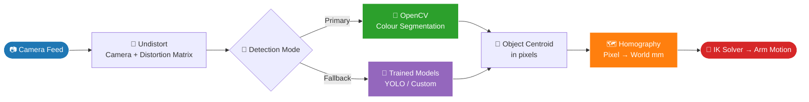
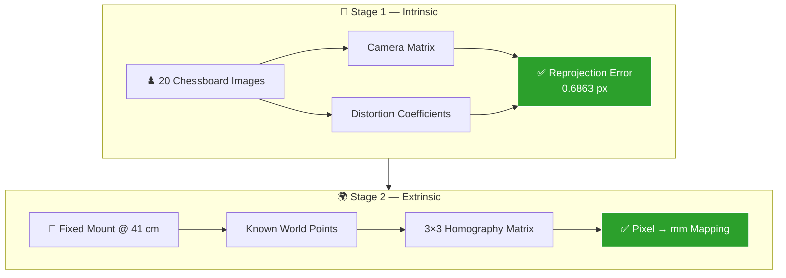

# 6_DoF_Arm-NeuralNexus

A six-degree-of-freedom (6-DOF) robotic arm for precise object manipulation and automation. The project spans the full stack — **custom hardware and embedded firmware**, **kinematics simulation**, and a **computer-vision pipeline for object detection and pick-and-place**.

<!-- Optional: add a hero photo or GIF of the arm here -->
<!--  -->

---

## Overview

NeuralNexus is a from-scratch robotic arm built around an STM32 microcontroller driving six stepper-motor axes. On top of the physical build sits an inverse-kinematics simulation (MATLAB) for validating motion before it runs on real hardware, and a vision system that detects target objects and drives the arm to pick and place them.

The project is organized into three subsystems that work together:

| Subsystem | What it does | Tech |
|-----------|--------------|------|
| **Hardware & Firmware** | Real-time multi-axis stepper control on the physical arm | STM32H743, C |
| **Kinematics Simulation** | Forward/inverse kinematics validation and motion planning | MATLAB |
| **Computer Vision** | Object detection + pick-and-place coordination | <!-- FILL IN: Python / OpenCV / YOLO etc. --> |

---

## Repository structure

```
6_DoF_Arm-NeuralNexus/
├── IK Simulation MATLAB/      # Inverse kinematics simulation (MATLAB)
├── Firmware/                  # STM32 firmware  <!-- FILL IN if/when added -->
├── Vision/                    # Object detection & pick-and-place  <!-- FILL IN -->
├── docs/                      # Diagrams, media, wiring notes  <!-- optional -->
├── .gitignore
└── README.md
```

<!-- Update this tree to match what you actually push. Right now only "IK Simulation MATLAB" exists. -->

---

## Hardware

The arm uses six stepper-driven axes with mixed motor and driver classes chosen per joint load:

| Axis | Motor | Driver | Notes |
|------|-------|--------|-------|
| M1 | NEMA 24 | CL57T (closed-loop) | Base / shoulder |
| M2 | NEMA 24 | CL57T (closed-loop) | Shoulder |
| M3 | NEMA 23 | DM542 | Elbow |
| M4 | NEMA 17 | TMC2209 | Wrist |
| M5 | NEMA 17 | TMC2209 | Wrist |
| M6 | NEMA 17 | TMC2209 | End effector / gripper |

**Controller:** STM32H743VITx @ 420 MHz (configured via STM32CubeMX).

**Wiring notes:**
- M1/M2/M3 drivers are **common-anode** wired — STEP+/DIR+/ENA+ tied to external +5 V, with the minus terminals driven by STM32 GPIO **open-drain** outputs (the MCU sinks current, it does not source it).
- M4–M6 (TMC2209) use standard push-pull 3.3 V direct drive.

---

## Firmware

Real-time step generation runs from a hardware timer ISR for stable, jitter-free pulse timing.

- **Step engine:** a single `Stepper_Update()` routine called from the **TIM6 ISR at 50 kHz**, using per-axis `stepInterval` / `stepCounter` logic.
- **Non-blocking pulses:** step pulses use a pulse-pending flag architecture rather than busy-wait delays, ensuring the pulse width is long enough for the drivers to register.
- **Enable logic:** `Stepper_SetEnableM1M2M3(false)` *enables* the M1/M2/M3 drivers (inverted polarity due to the open-drain + opto-isolator wiring).

<!-- If firmware lives in a separate repo, link it here, e.g.: -->
<!-- Firmware source: https://github.com/Lasan-Perera/NeuralNexusArm_CodeBase -->

---

## Kinematics Simulation (MATLAB)

The `IK Simulation MATLAB/` folder contains the inverse-kinematics model used to validate arm poses and trajectories before running them on hardware.

**Requirements:** see [`IK Simulation MATLAB/REQUIREMENTS.txt`](IK%20Simulation%20MATLAB/REQUIREMENTS.txt) for the MATLAB release and required toolboxes.

**Run it:**
1. Open MATLAB and `cd` into `IK Simulation MATLAB`.
2. Run the main script <!-- FILL IN: e.g. `run_ik_sim.m` -->.

---

## Computer Vision — Object Detection & Pick-and-Place

<!-- FILL IN this whole section with your actual stack. Template below: -->

The vision subsystem detects target objects, estimates their position, and commands the arm to pick and place them.

- **Camera:** <!-- FILL IN: e.g. USB webcam / Intel RealSense / Pi camera -->
- **Detection:** <!-- FILL IN: e.g. YOLOv8 / OpenCV color+contour / custom model -->
- **Coordinate mapping:** camera-space detections are converted to arm-space coordinates (hand-eye / calibration) <!-- FILL IN details -->
- **Pick-and-place flow:** detect → locate → compute IK target → move → grip → place.

**Run it:**
```bash
# FILL IN: e.g.
# cd Vision
# pip install -r requirements.txt
# python detect_and_pick.py
```

---

## Getting Started

```bash
git clone https://github.com/Lasan-Perera/6_DoF_Arm-NeuralNexus.git
cd 6_DoF_Arm-NeuralNexus
```

Then follow the setup for whichever subsystem you're working on (simulation, firmware, or vision) in the sections above.

---

## Roadmap

- [x] Confirmed multi-axis motor rotation on hardware
- [x] Inverse kinematics simulation (MATLAB)
- [ ] Per-axis speed / acceleration tuning across all six motors
- [ ] TMC2209 torque-at-speed fix (StealthChop → SpreadCycle)
- [ ] Object detection integration
- [ ] Full closed-loop pick-and-place
- [ ] Coordinated multi-axis motion planning

# 👁️ Computer Vision & Object Detection


> **The eyes of the NeuralNexusArm.** This subsystem turns raw camera pixels into real-world `(X, Y)` coordinates that feed straight into the inverse kinematics solver — closing the loop between *seeing* and *reaching*.

---

## 🔁 Pipeline Overview



---

## 🎨 Object Detection

### 🥇 Primary — OpenCV Colour Identification

The main detection path uses **classical colour segmentation** (HSV thresholding → contour extraction → centroid).

Why classical over learned, as the default?

| ⚡ Latency | 🎯 Determinism | 💻 Compute | 🔧 Tunability |
|:---:|:---:|:---:|:---:|
| Millisecond-scale | Same input → same output, every time | Runs comfortably on CPU | Live HSV slider tuning |

### 🧠 Secondary — Trained Detectors

For objects that colour alone cannot separate, the repository also ships learned detectors:

| Model | Target | Type |
|---|---|:---:|
| 📦 Custom trained | Cardboard box detection |  |
| 🍬 Custom trained | Candy detection |  |
| `yolo26n.pt` | General-purpose objects |  |
| `yolo11n.pt` | General-purpose objects |  |

---

## 📐 Camera Calibration

Calibration runs in **two independent stages** — first fix the *camera*, then fix the *world*.



### ♟️ Stage 1 — Chessboard Calibration *(Intrinsic)*

Standard OpenCV chessboard calibration recovers two matrices:

<table>
<tr>
<td width="50%">

**🔭 Camera Matrix**

Describes the camera's *own* optical properties:
- Focal lengths `fx`, `fy`
- Principal point `cx`, `cy`

</td>
<td width="50%">

**🌀 Distortion Coefficients**

Model and cancel lens distortion:
- Radial (barrel / pincushion)
- Tangential (sensor misalignment)

</td>
</tr>
</table>

**Method** — 20 chessboard images captured at varying angles, orientations, and positions across the frame.

<!-- Rendered as a green "Tip" callout on GitHub -->
> [!TIP]
> **Result: mean reprojection error = `0.6863 px`** — comfortably sub-pixel, which is a healthy calibration for a 20-image set.

### 🗺️ Stage 2 — Homographic Calibration *(Pixel → World)*

With the camera **rigidly mounted at a fixed height**, a single `3×3` homography maps undistorted pixel coordinates to real-world planar coordinates in the arm's base frame.

Because the pose is fixed and every target lies on one plane (the table surface), **no per-frame depth estimation is required** — one matrix does the whole job.

```
┌─────────────────────────────────────────┐
│   📷  Camera                            │
│    │                                    │
│    │  ↕  Fixed height = 41 cm           │
│    │                                    │
│  ══╧══════════════════════════════════  │  ← Work surface (Z = 0)
│      🎯 Targets live on this plane      │
└─────────────────────────────────────────┘
```

<!-- Rendered as a red "Warning" callout on GitHub -->
> [!WARNING]
> The homography is valid **only** for this exact mounting height and pose. Move or re-aim the camera and the homographic calibration **must be redone** — the intrinsic calibration, however, stays valid.

---

<div align="center">

**📷 Pixels in → 🦾 Motion out**

</div>

---

## Author

**Lasan Perera** — [@Lasan-Perera](https://github.com/Lasan-Perera)

<!-- ## License -->
<!-- Add a license here (e.g. MIT) if you want others to reuse the code. -->
